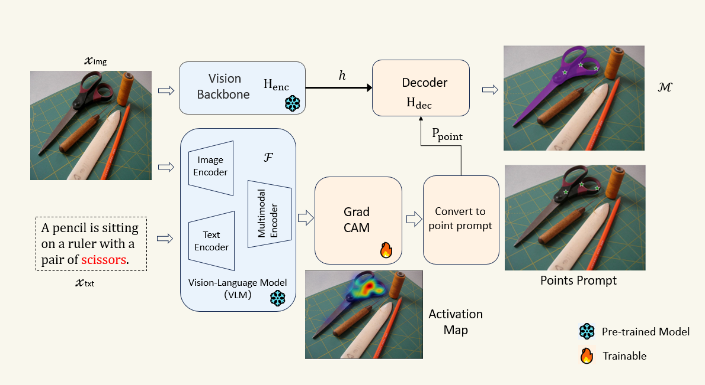

# APOVIS：Automated Pixel-Level Open-Vocabulary Instance Segmentation through Integration of Pre-trained Vision-Language Models and Foundational Segmentation Models

  

## Requirements
torch == 2.1; python == 3.1
## Install [SAM](https://github.com/facebookresearch/segment-anything.git) base model
## For the code, please refer to [Mask-free-OVIS](https://github.com/Vibashan/Mask-free-OVIS)
## BibTeX
@article{Ma2024APOVISAP,
  title={APOVIS: Automated pixel-level open-vocabulary instance segmentation through integration of pre-trained vision-language models and foundational segmentation models},
  author={Qiujie Ma and Shuqi Yang and Lijuan Zhang and Qing Lan and Dongdong Yang and Honghan Chen and Ying Tan},
  journal={Image Vis. Comput.},
  year={2024},
  volume={154},
  pages={105384},
  url={https://api.semanticscholar.org/CorpusID:274767306}
}
